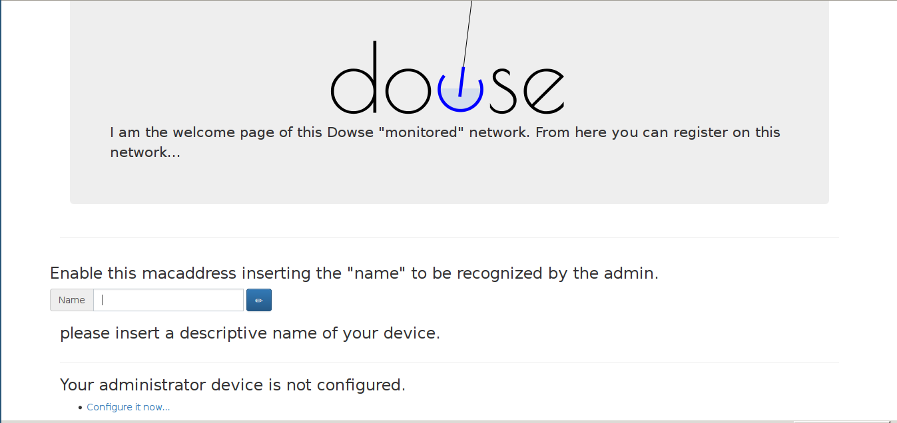
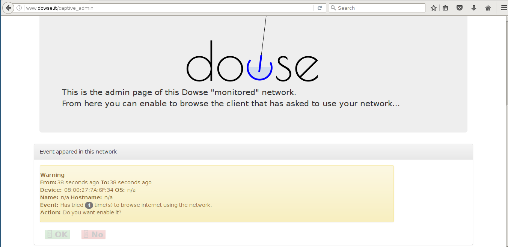
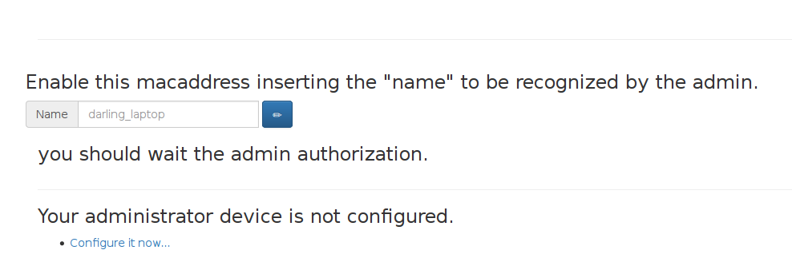
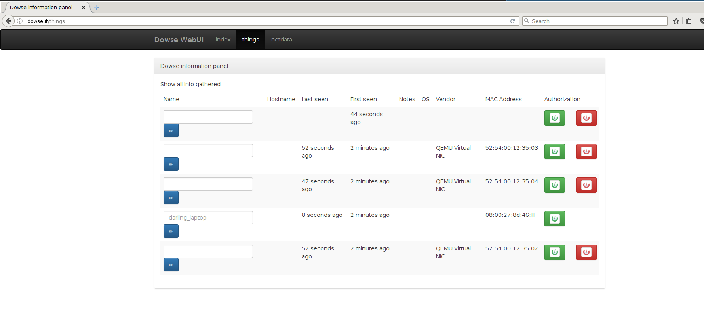

cd# Dowse Configuration

To properly configure Dowse, we suggest to keep in mind the role of any configuration file.

They are:
* `/etc/dowse/settings`
* `/etc/dowse/network`

## /etc/dowse/settings

In this file you can configure all parameter that characterize the Dowse box, to instance the value you should use the typical syntax *key=value* and the hash `#` to comment .

The parameter more frequently configured are :
- _interface_ : it's the network interface to expose the internal dowse network.
- _address_ : it's the dowse host address.
- *dowse_net* : it's the dowse network mask.
- *dowse_guests* : it's DHCP server parameter to distribute the address (it's expressed in the form _start address_,_end address_,_lease time_.
- _wan_ : it's the network address behing to masquerade the network.
- *internet_interface* : it's the network interface should be routed to provide internet access.
- _dns_ : it's the external DNS providing dns query resolution services.

# First navigation

1) You should connect to :

[http://www.dowse.it/](http://www.dowse.it/)

and you look an web page like this:

Click on "Configure it now ..." from the device that you want to grant admin privileges.

go to:

[http://www.dowse.it/captive_admin](http://www.dowse.it/captive_admin)

At the page bottom you are going to find a panel titled **Event appared in this network**:

describing the event occured.

In this case your device has tried to browse the internet 4 times.

Click on `Ok` to enable the device to navigate on the network.

# New things

What's happen when a new thing appear in your network?

Simply, the dowse holystic ecosystem reveal and block the traffic generated by new thing that is trying to use your network.

If you are in a party with new friend navigating they will be redirect on the captive portal client-side and then thing
can insert a name to descript themselves, this "name" will be also used by DNS Dowse to resolve query name, keep in mind to didn't use special character.

if you connect with admin granted device on the link:

[http://www.dowse.it/captive_admin](http://www.dowse.it/captive_admin)

You can manage the Things that Dowse has discovered in the network :

The green / red button shows the authorization state the relative things was granted.

Keep in mind:
 * when both the button are present, this means the things it was not granted to browse, yet.
   In this case clicking on a button grant or revoke the privileges.
 * when it's present only on button means that the things privileges to browse, it was granted/revoked.
   Clicking on the button change the state of privileges.
   

Have fun